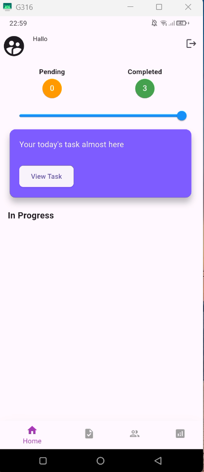
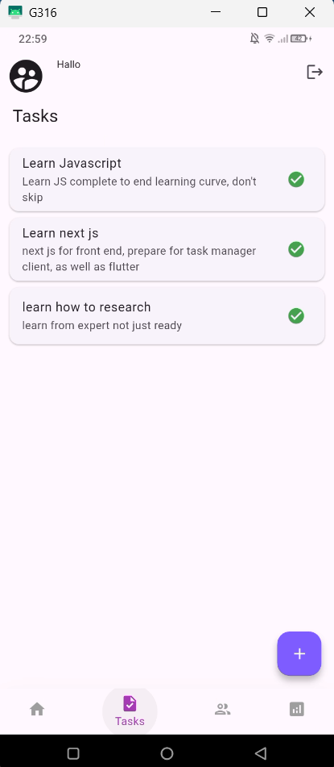
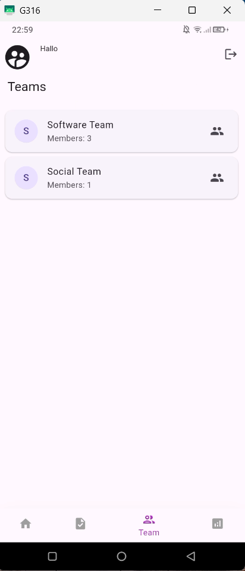
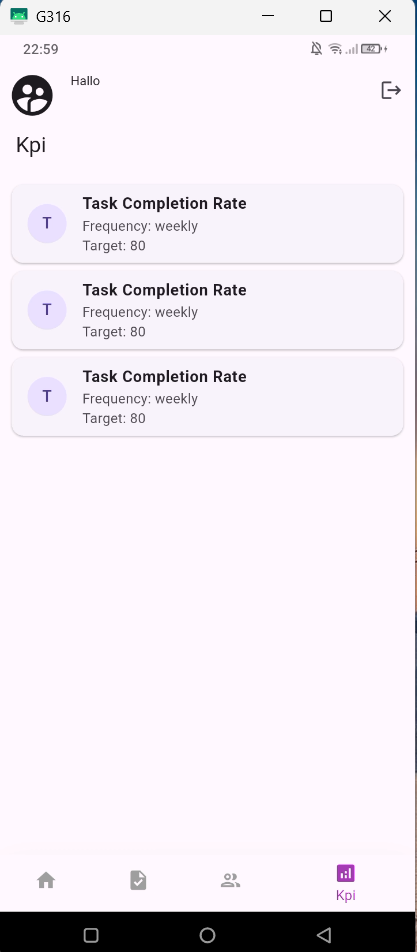

# 📱 task_manager_client

A sleek and scalable Flutter-based client for managing personal and team tasks with ease. This app offers a dynamic UI, efficient local storage, and real-time progress tracking — perfect for productivity lovers and organized teams alike.

## 🚀 Features

- 🔐 **User Authentication** – Secure login with token storage
- ✅ **Task Management** – Create, categorize, and track task completion
- 📊 **KPI Dashboard** – Visual feedback on completed vs. pending tasks
- 👥 **Team Support** – View teams, members, and their assignments
- 💾 **Offline Persistence** – Tasks and user data saved via local storage
- 🔄 **State Management** – Powered by clean architecture, modular files, and reusability

## 🖼️ Screenshots

| Home | Tasks | Teams | KPI |
|------|-------|-------|-----|
|  |  |  |  |

## 🛠️ Tech Stack

- Flutter (UI Toolkit)
- Dart (Programming Language)
- Provider / FutureBuilder (State Management)
- SharedPreferences (Local Storage)

## 📂 Structure Overview
